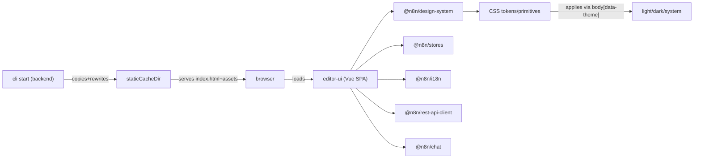

## Design / UI / UX / Frontend map

This document is a pointer index for where UI, UX, and design-system concerns live in this repo.
It is intentionally a map (entrypoints + responsibilities), not a style guide.

### TL;DR entrypoints

| Area | What it is | Start here |
| --- | --- | --- |
| Main web app (SPA) | Vue 3 workflow editor UI | [`packages/frontend/editor-ui/src/main.ts`](../packages/frontend/editor-ui/src/main.ts) |
| App shell / layout | Layout grid, modals, banners, command bar, assistants | [`packages/frontend/editor-ui/src/app/App.vue`](../packages/frontend/editor-ui/src/app/App.vue) |
| Routing + guards | Routes, view composition, init hooks | [`packages/frontend/editor-ui/src/app/router.ts`](../packages/frontend/editor-ui/src/app/router.ts) |
| App init | Core init + authenticated feature init | [`packages/frontend/editor-ui/src/app/init.ts`](../packages/frontend/editor-ui/src/app/init.ts) |
| Theme switching | Sets/removes `body[data-theme]`, supports query override | [`packages/frontend/editor-ui/src/app/stores/ui.utils.ts`](../packages/frontend/editor-ui/src/app/stores/ui.utils.ts) |
| Design tokens (CSS vars) | Primitives + semantic tokens + light/dark theme rules | [`packages/frontend/@n8n/design-system/src/css/_primitives.scss`](../packages/frontend/@n8n/design-system/src/css/_primitives.scss), [`_tokens*.scss`](../packages/frontend/@n8n/design-system/src/css/) |
| Design components | Shared component library used by editor-ui and others | [`packages/frontend/@n8n/design-system/src/components/`](../packages/frontend/@n8n/design-system/src/components/) |
| Shared Pinia root store | Reads config from meta tags (rest endpoint, etc) | [`packages/frontend/@n8n/stores/src/useRootStore.ts`](../packages/frontend/@n8n/stores/src/useRootStore.ts) |
| Embedded chat widget | Embeddable chat UI package | [`packages/frontend/@n8n/chat/`](../packages/frontend/@n8n/chat/) |
| Extensions (frontend) | Extend UI via `n8n.manifest.json` + extension SDK | [`packages/extensions/`](../packages/extensions/), [`packages/@n8n/extension-sdk/`](../packages/@n8n/extension-sdk/) |
| Backend UI serving | Serves SPA + static assets; SPA fallback routing | [`packages/cli/src/server.ts`](../packages/cli/src/server.ts) |
| Backend UI injection | Injects config tags + base path into built UI | [`packages/cli/src/commands/start.ts`](../packages/cli/src/commands/start.ts) |
| Frontend settings payload | BE -> FE settings that drive many UX branches | [`packages/cli/src/services/frontend.service.ts`](../packages/cli/src/services/frontend.service.ts) |
| E2E tests | Playwright UI/e2e tests | [`packages/testing/playwright/`](../packages/testing/playwright/) |

### Architecture at a glance

### Where to change X (quick cheat sheet)

| Goal | Primary files/dirs | Notes |
| --- | --- | --- |
| Change theme colors (light) | [`packages/frontend/@n8n/design-system/src/css/_tokens.scss`](../packages/frontend/@n8n/design-system/src/css/_tokens.scss) | Defines `:root` tokens; includes backwards-compatible fallbacks for legacy variable names. |
| Change theme colors (dark) | [`packages/frontend/@n8n/design-system/src/css/_tokens.dark.scss`](../packages/frontend/@n8n/design-system/src/css/_tokens.dark.scss) | Applies under `body[data-theme='dark']` and `prefers-color-scheme: dark` when no override. |
| Change raw palette / spacing / typography scale | [`packages/frontend/@n8n/design-system/src/css/_primitives.scss`](../packages/frontend/@n8n/design-system/src/css/_primitives.scss) | Primitives should generally map into tokens (avoid consuming directly in components). |
| Change theme switching logic | [`packages/frontend/editor-ui/src/app/stores/ui.utils.ts`](../packages/frontend/editor-ui/src/app/stores/ui.utils.ts), [`ui.store.ts`](../packages/frontend/editor-ui/src/app/stores/ui.store.ts) | Theme is stored in localStorage; `system` removes `data-theme` attribute. |
| Add/edit shared UI components | [`packages/frontend/@n8n/design-system/src/components/`](../packages/frontend/@n8n/design-system/src/components/) | Storybook lives with the design system. |
| Adjust global app layout / shell | [`packages/frontend/editor-ui/src/app/App.vue`](../packages/frontend/editor-ui/src/app/App.vue) | Contains grid regions: banners/header/sidebar/content/modals, plus assistant and command bar. |
| Add/modify routes | [`packages/frontend/editor-ui/src/app/router.ts`](../packages/frontend/editor-ui/src/app/router.ts) | Routes compose named views (header/sidebar/footer). Also runs `initializeCore()` and `initializeAuthenticatedFeatures()`. |
| Add/modify feature UI | [`packages/frontend/editor-ui/src/features/`](../packages/frontend/editor-ui/src/features/) | Domain features: workflows, credentials, settings, execution, ai, etc. |
| Edit global styles / overrides | [`packages/frontend/editor-ui/src/app/css/`](../packages/frontend/editor-ui/src/app/css/), [`packages/frontend/editor-ui/src/main.scss`](../packages/frontend/editor-ui/src/main.scss) | `main.scss` stitches together design system + chat + app SCSS. |
| Update Sass variables used in app SCSS | [`packages/frontend/editor-ui/src/app/css/_variables.scss`](../packages/frontend/editor-ui/src/app/css/_variables.scss) | Maps CSS vars (tokens) into Sass vars for legacy SCSS. |
| Tailwind behavior (editor-ui) | [`packages/frontend/editor-ui/tailwind.config.js`](../packages/frontend/editor-ui/tailwind.config.js) | Dark mode selector is `[data-theme=\"dark\"]`. |
| Tailwind behavior (design-system) | [`packages/frontend/@n8n/design-system/tailwind.config.js`](../packages/frontend/@n8n/design-system/tailwind.config.js) | Same dark selector. |
| Change embedded chat widget behavior | [`packages/frontend/@n8n/chat/src/index.ts`](../packages/frontend/@n8n/chat/src/index.ts) | Public API is `createChat()`. |
| Change embedded chat widget styling | [`packages/frontend/@n8n/chat/src/css/_tokens.scss`](../packages/frontend/@n8n/chat/src/css/_tokens.scss) | Chat uses its own `--chat--*` tokens. |
| Update i18n strings | [`packages/frontend/@n8n/i18n/src/locales/`](../packages/frontend/@n8n/i18n/src/locales/) | `editor-ui` sets language in `App.vue` based on root store `defaultLocale`. |
| Update UI config injection | [`packages/cli/src/commands/start.ts`](../packages/cli/src/commands/start.ts) | Rewrites `%CONFIG_TAGS%`, `/{{BASE_PATH}}/`, `{{REST_ENDPOINT}}` into built `editor-ui` assets. |
| Change what BE exposes to FE | [`packages/cli/src/services/frontend.service.ts`](../packages/cli/src/services/frontend.service.ts) | Produces settings payload for FE settings store / UX toggles. |
| Change transactional email branding | [`packages/cli/src/user-management/email/templates/`](../packages/cli/src/user-management/email/templates/) | MJML templates + inline `n8n-logo.png` attachment. |

### Frontend workspaces (packages/frontend)

The UI surface is primarily organized under `packages/frontend/`:

- [`packages/frontend/editor-ui/`](../packages/frontend/editor-ui/) - main Vue SPA (workflow editor, settings, etc)
- [`packages/frontend/@n8n/design-system/`](../packages/frontend/@n8n/design-system/) - shared UI components + CSS tokens + Storybook
- [`packages/frontend/@n8n/chat/`](../packages/frontend/@n8n/chat/) - embeddable chat widget package
- [`packages/frontend/@n8n/i18n/`](../packages/frontend/@n8n/i18n/) - frontend i18n helpers + locales
- [`packages/frontend/@n8n/stores/`](../packages/frontend/@n8n/stores/) - shared Pinia stores (root store, meta tag config, etc)
- [`packages/frontend/@n8n/composables/`](../packages/frontend/@n8n/composables/) - shared Vue composables
- [`packages/frontend/@n8n/rest-api-client/`](../packages/frontend/@n8n/rest-api-client/) - typed REST API client
- [`packages/frontend/@n8n/storybook/`](../packages/frontend/@n8n/storybook/) - shared Storybook config (`main.ts`)

### Main web app: packages/frontend/editor-ui

#### Structure (high level)

- `src/main.ts` - Vue app creation + plugin wiring + mount; imports design-system/app/chat styles.
- `src/app/` - cross-cutting app framework:
  - `router.ts` routes, guards, named-view layout composition
  - `init.ts` initialization flows
  - `stores/` Pinia stores (UI state, settings, workflows, etc)
  - `components/` shared app-level components (modals, headers, sidebars, banners, etc)
  - `plugins/` global plugin integrations (telemetry, sentry, directives, components)
  - `css/` global SCSS, element-plus overrides, app vars
  - `utils/` helpers including RBAC middleware/utilities
  - `moduleInitializer/` internal module system (routes/modals/resources/settings pages)
- `src/features/` - product features grouped by domain (ai, workflows, settings, credentials, execution, etc)
- `src/Interface.ts` - shared types; also re-exports design-system types.

#### How the UI boots (prod vs dev)

- **Prod build**:
  - `n8n-editor-ui` builds to `packages/frontend/editor-ui/dist/` (Vite build).
  - On backend startup, [`packages/cli/src/commands/start.ts`](../packages/cli/src/commands/start.ts) copies the built assets into `staticCacheDir` and rewrites placeholders:
    - `%CONFIG_TAGS%` -> meta tags containing base64-encoded FE config (REST endpoint path + Sentry config)
    - `/{{BASE_PATH}}/` -> configured base path (also rewrites URL-encoded variants)
    - `{{REST_ENDPOINT}}` -> configured REST endpoint path
- **Dev server**:
  - [`packages/frontend/editor-ui/vite.config.mts`](../packages/frontend/editor-ui/vite.config.mts) strips `%CONFIG_TAGS%` when running under Vite and rewrites base path/rest endpoint for local dev.

#### Early page scripts/styles (before the SPA runs)

[`packages/frontend/editor-ui/index.html`](../packages/frontend/editor-ui/index.html) loads:

- `public/static/prefers-color-scheme.css` - sets a dark background when OS prefers dark (reduces flash)
- `public/static/base-path.js` - sets `window.BASE_PATH = '/{{BASE_PATH}}/'` (rewritten in prod)
- `public/static/posthog.init.js` - PostHog snippet bootstrap (actual config comes from app settings)

### Styling and theming

#### Theme model

- UI theme choice is stored in localStorage and applied by setting/removing `body[data-theme]`:
  - [`packages/frontend/editor-ui/src/app/stores/ui.utils.ts`](../packages/frontend/editor-ui/src/app/stores/ui.utils.ts) (`applyThemeToBody`, `getThemeOverride`)
  - [`packages/frontend/editor-ui/src/app/stores/ui.store.ts`](../packages/frontend/editor-ui/src/app/stores/ui.store.ts) (`theme`, `appliedTheme`, `setTheme`)
- `system` theme means "no explicit override": `data-theme` is removed and CSS uses `prefers-color-scheme` fallbacks.

#### Token sources of truth

- Primitives: [`packages/frontend/@n8n/design-system/src/css/_primitives.scss`](../packages/frontend/@n8n/design-system/src/css/_primitives.scss)
- Tokens (default/light + common): [`packages/frontend/@n8n/design-system/src/css/_tokens.scss`](../packages/frontend/@n8n/design-system/src/css/_tokens.scss)
- Tokens (dark overrides): [`packages/frontend/@n8n/design-system/src/css/_tokens.dark.scss`](../packages/frontend/@n8n/design-system/src/css/_tokens.dark.scss)
- CSS entrypoint imported by apps: [`packages/frontend/@n8n/design-system/src/css/index.scss`](../packages/frontend/@n8n/design-system/src/css/index.scss)

#### CSS variable naming convention

- Custom stylelint rule `@n8n/css-var-naming` and vocabulary: [`packages/@n8n/stylelint-config/README.md`](../packages/@n8n/stylelint-config/README.md)
- Quick reference of common token names: [`packages/frontend/AGENTS.md`](../packages/frontend/AGENTS.md)

### Design system: packages/frontend/@n8n/design-system

- Entry exports: [`packages/frontend/@n8n/design-system/src/index.ts`](../packages/frontend/@n8n/design-system/src/index.ts)
- Components: [`packages/frontend/@n8n/design-system/src/components/`](../packages/frontend/@n8n/design-system/src/components/)
  - Icon system: [`packages/frontend/@n8n/design-system/src/components/N8nIcon/`](../packages/frontend/@n8n/design-system/src/components/N8nIcon/) (see `icons.ts`)
- CSS:
  - `src/css/index.scss` includes primitives + tokens + per-component SCSS pieces.
  - Fonts are defined in [`src/css/fonts.scss`](../packages/frontend/@n8n/design-system/src/css/fonts.scss) and loaded from [`assets/fonts/`](../packages/frontend/@n8n/design-system/assets/fonts/).
- Design-system Storybook:
  - Uses shared config in [`packages/frontend/@n8n/storybook/main.ts`](../packages/frontend/@n8n/storybook/main.ts)
  - Styleguide stories (colors/spacing/fonts): [`packages/frontend/@n8n/design-system/src/styleguide/`](../packages/frontend/@n8n/design-system/src/styleguide/)

### Shared frontend foundations

- `@n8n/stores`:
  - Root store (base URL, endpoints, defaultLocale, etc): [`packages/frontend/@n8n/stores/src/useRootStore.ts`](../packages/frontend/@n8n/stores/src/useRootStore.ts)
  - Meta tag config helpers (reads base64 meta tags inserted by BE): [`packages/frontend/@n8n/stores/src/metaTagConfig.ts`](../packages/frontend/@n8n/stores/src/metaTagConfig.ts)
- `@n8n/i18n`: locales and translation helpers live under [`packages/frontend/@n8n/i18n/src/`](../packages/frontend/@n8n/i18n/src/)
- `@n8n/rest-api-client`: API calls under [`packages/frontend/@n8n/rest-api-client/src/`](../packages/frontend/@n8n/rest-api-client/src/)
- `@n8n/composables`: shared Vue composables under [`packages/frontend/@n8n/composables/src/`](../packages/frontend/@n8n/composables/src/)

### Embedded chat widget: packages/frontend/@n8n/chat

- Public entry: [`packages/frontend/@n8n/chat/src/index.ts`](../packages/frontend/@n8n/chat/src/index.ts) (`createChat()`)
- Chat token sheet: [`packages/frontend/@n8n/chat/src/css/_tokens.scss`](../packages/frontend/@n8n/chat/src/css/_tokens.scss)
- Markdown + highlight.js theme switching:
  - `markdown.scss` loads `github.css` by default and switches to `github-dark-dimmed.css` when `body[data-theme='dark']` or OS prefers dark and no override: [`packages/frontend/@n8n/chat/src/css/markdown.scss`](../packages/frontend/@n8n/chat/src/css/markdown.scss)
- Build/backwards compatibility:
  - [`packages/frontend/@n8n/chat/vite.config.mts`](../packages/frontend/@n8n/chat/vite.config.mts) renames `dist/chat.css` to `dist/style.css` (required by existing integrations).

### Modular UI and extensions

#### Editor UI internal module system

Editor UI has an internal module registry that can register routes/modals/resources/settings pages at boot:

- Core: [`packages/frontend/editor-ui/src/app/moduleInitializer/moduleInitializer.ts`](../packages/frontend/editor-ui/src/app/moduleInitializer/moduleInitializer.ts)
- Descriptors (current built-in modules):
  - Insights: [`packages/frontend/editor-ui/src/features/execution/insights/module.descriptor.ts`](../packages/frontend/editor-ui/src/features/execution/insights/module.descriptor.ts)
  - Data Table: [`packages/frontend/editor-ui/src/features/core/dataTable/module.descriptor.ts`](../packages/frontend/editor-ui/src/features/core/dataTable/module.descriptor.ts)
  - MCP: [`packages/frontend/editor-ui/src/features/ai/mcpAccess/module.descriptor.ts`](../packages/frontend/editor-ui/src/features/ai/mcpAccess/module.descriptor.ts)
  - Chat Hub: [`packages/frontend/editor-ui/src/features/ai/chatHub/module.descriptor.ts`](../packages/frontend/editor-ui/src/features/ai/chatHub/module.descriptor.ts)

#### Extension SDK and example extension

- SDK: [`packages/@n8n/extension-sdk/`](../packages/@n8n/extension-sdk/)
- Example extension: [`packages/extensions/insights/`](../packages/extensions/insights/)
  - Manifest (declares what views/components to extend): [`packages/extensions/insights/n8n.manifest.json`](../packages/extensions/insights/n8n.manifest.json)
  - Frontend entry: [`packages/extensions/insights/src/frontend/index.ts`](../packages/extensions/insights/src/frontend/index.ts)

### Backend pieces that influence UI/UX

- UI dist resolution: `EDITOR_UI_DIST_DIR` points at the installed `n8n-editor-ui/dist`:
  - [`packages/cli/src/constants.ts`](../packages/cli/src/constants.ts)
- UI injection and static cache compilation:
  - [`packages/cli/src/commands/start.ts`](../packages/cli/src/commands/start.ts) (`generateConfigTags()`, `generateStaticAssets()`)
- UI serving (SPA fallback + static assets):
  - [`packages/cli/src/server.ts`](../packages/cli/src/server.ts) serves `staticCacheDir` + `EDITOR_UI_DIST_DIR` and falls back to `index.html` for non-API routes.
- Settings payload for the FE (drives feature flags, telemetry settings, endpoints, etc):
  - [`packages/cli/src/services/frontend.service.ts`](../packages/cli/src/services/frontend.service.ts)
- Transactional email UX (templates + inline logo):
  - Templates: [`packages/cli/src/user-management/email/templates/`](../packages/cli/src/user-management/email/templates/)
  - Mailer: [`packages/cli/src/user-management/email/user-management-mailer.ts`](../packages/cli/src/user-management/email/user-management-mailer.ts)
  - Inline logo attachment configuration: [`packages/cli/src/user-management/email/node-mailer.ts`](../packages/cli/src/user-management/email/node-mailer.ts)

### Testing

- Editor UI unit tests live alongside code (`src/**/__tests__`, `*.test.ts`) under [`packages/frontend/editor-ui/src/`](../packages/frontend/editor-ui/src/)
- Design system unit tests live under [`packages/frontend/@n8n/design-system/src/__tests__/`](../packages/frontend/@n8n/design-system/src/__tests__/)
- Playwright e2e tests: [`packages/testing/playwright/`](../packages/testing/playwright/)

### Third-party UI patches

This monorepo uses pnpm patched dependencies (see root `package.json` -> `pnpm.patchedDependencies`):

- Patch files live in [`patches/`](../patches/)
- UI-adjacent examples: `patches/element-plus@2.4.3.patch`, `patches/v-code-diff.patch`, `patches/z-vue-scan.patch`

### Related docs

- Branding/fork customization guide: [`docs/custom-fork.md`](custom-fork.md)
- Operational checklist for a branded fork: [`docs/custom-fork-checklist.md`](custom-fork-checklist.md)
