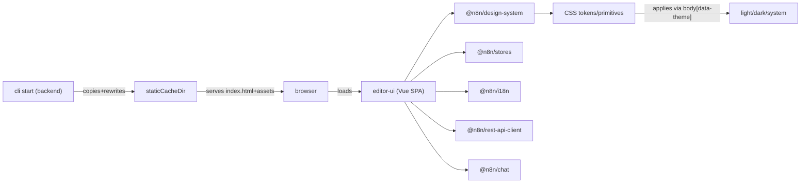

# Design / UI / UX / Frontend map

This document is a pointer index for where UI, UX, and design-system concerns live in this repo.
It is intentionally a map (entrypoints + responsibilities), not a style guide.

## Design Overhaul Complexity Assessment

  TL;DR: Moderate to High - but the architecture is well-suited for it

  The codebase has excellent bones for a design overhaul due to its token-based architecture, but the sheer surface area is significant.

  ---
  Quantified Scope

  | Layer                    | Count               | Effort Level                          |
  |--------------------------|---------------------|---------------------------------------|
  | Design System Components | 104                 | Medium                                |
  | Editor-UI Vue Components | 574                 | Low-Medium (most inherit from tokens) |
  | App-Level Components     | 86                  | Low-Medium                            |
  | SCSS Files               | 89                  | Medium                                |
  | CSS Token Usages         | ~14,300 instances   | Cascading (change once, affect all)   |
  | Hardcoded Colors         | ~550 instances      | Medium (need individual fixes)        |
  | Element Plus Overrides   | 38 files            | Medium-High                           |
  | Modals/Dialogs           | 29 types, 66 files  | Low (centralized)                     |
  | Canvas/Workflow Editor   | 42+ components      | High (SVG/interactive)                |
  | Icon Customizations      | 40 custom SVGs      | Low-Medium                            |

  ---
  Three-Tier Effort Breakdown

  Tier 1: "Quick Rebrand" (Days)

  What you can change with minimal effort:

  - Primary/accent colors: Update 1 file (_primitives.scss) - cascades to ~14,300 usages
  - Logo: Replace 2 SVGs in N8nLogo/
  - Favicon: Replace 1 file
  - Window title: Update 2 constants
  - Email branding: Update logo PNG + MJML templates

  Files touched: ~10
  Risk: Very low

  ---
  Tier 2: "Theme Refresh" (1-2 Weeks)

  Meaningful visual change while preserving architecture:

  - Everything in Tier 1, plus:
  - Full color palette: Update primitives + token mappings
  - Dark mode: Ensure parity in _tokens.dark.scss
  - Typography: Swap fonts in fonts.scss, update font-related tokens
  - Spacing/sizing: Adjust spacing scale in primitives
  - Fix hardcoded colors: ~550 instances across SCSS/Vue
  - Element Plus customizations: Update 38 override files

  Files touched: ~100-150
  Risk: Low-Medium (may find edge cases in specific components)

  ---
  Tier 3: "Complete Design Overhaul" (4-8 Weeks)

  Fundamentally different look and feel:

  All of the above, plus:

  | Area                            | Work Required                                                       | Complexity                              |
  |---------------------------------|---------------------------------------------------------------------|-----------------------------------------|
  | Design System Components        | Review/restyle 104 components                                       | High - each has unique styling concerns |
  | Workflow Canvas                 | Custom SVG styling, node shapes, edges, animations                  | Very High - core visual identity        |
  | Code Editors                    | CodeMirror theme customization                                      | Medium                                  |
  | Element Plus Deep Customization | May need to replace/heavily customize dropdowns, date pickers, etc. | High                                    |
  | Icons                           | May need to replace/add custom icons                                | Medium                                  |
  | Storybook Updates               | 97 stories to verify                                                | Low (but time-consuming)                |
  | V2 Components Migration         | 11 new components in progress                                       | Medium                                  |
  | Testing                         | Visual regression across browsers                                   | Medium                                  |

  ---
  Critical Path Items

  1. Workflow Canvas (Highest Risk)
  - 42+ components with interactive SVG elements
  - Inline styles for zoom/positioning
  - Vue Flow library customizations
  - Node icons, connection lines, status indicators
  - This is the visual heart of n8n - changes here are highly visible

  2. Element Plus Dependency
  - Currently wraps: dropdowns, pagination, inputs, tooltips, dialogs, color pickers
  - Options:
    - A) Keep and deeply customize (38 files already exist)
    - B) Replace with Reka-UI (already partially using) + custom styling
    - C) Hybrid approach
  - Swapping UI libraries would be a major undertaking

  3. NDV (Node Details View)
  - 82 components - most complex feature area
  - Heavy forms, dynamic parameters, code editors
  - High user interaction - needs careful attention

  ---
  Architectural Advantages

  The codebase is well-prepared for design changes:

  1. Token-based system: 96% of color usage is through CSS variables
  2. Backwards compatibility: Dual token formats (--color-primary and --color--primary)
  3. Centralized modal system: One component controls all dialogs
  4. Component library separation: Design system is separate from app logic
  5. Clear primitives → tokens → components hierarchy
  6. Storybook: 97 stories for visual testing

  ---
  Recommended Approach

  Phase 1 (Week 1): Foundation
  ├── Update color primitives
  ├── Update typography/fonts
  ├── Replace logos/favicon
  ├── Fix most impactful hardcoded colors

  Phase 2 (Week 2-3): Component Library
  ├── Systematically update design-system components
  ├── Update Element Plus overrides
  ├── Verify in Storybook

  Phase 3 (Week 3-5): Application Features
  ├── Workflow canvas styling
  ├── NDV/panel styling
  ├── Modal/dialog styling
  ├── Feature-specific adjustments

  Phase 4 (Week 5-6): Polish
  ├── Fix edge cases
  ├── Cross-browser testing
  ├── Dark mode parity
  ├── Performance verification

  ---
  Bottom Line

  | Overhaul Level    | Timeline   | Team Size | Risk       |
  |-------------------|------------|-----------|------------|
  | Quick Rebrand     | 2-3 days   | 1 dev     | Low        |
  | Theme Refresh     | 1-2 weeks  | 1-2 devs  | Low-Medium |
  | Complete Overhaul | 4-8 weeks  | 2-3 devs  | Medium     |
  | UI Library Swap   | 3-6 months | 3+ devs   | High       |

  The token architecture means you get a lot of bang for your buck on Tier 1-2 changes. A complete overhaul is definitely doable, but the workflow canvas will be your biggest challenge - it's where n8n's visual identity lives.

## Branding Customization

> **Phase 00 Status:** Foundation complete. All items below marked with [x] have been implemented as part of the Obsidian Forge design overhaul.
>
> **Phase 01 Status:** Component Library complete. Design-system components and Element Plus overrides have been updated with Obsidian Forge tokens.
>
> **Phase 02 Status:** Application Features complete. Canvas, NDV, modals, and overlay components have been themed with Obsidian Forge tokens. Sessions completed:
> - Session 01-03: Workflow canvas foundation, node styling, connection interactions
> - Session 04-05: NDV layout, forms, and code editor theming
> - Session 06-07: Modal/dialog system and overlay components (notifications, tooltips, popovers, dropdowns, loading)

### Logo Assets

**Favicon:** `packages/frontend/editor-ui/public/`

- [x] Create/obtain brand favicon
- [x] Replace `favicon.ico` (multi-size: 16, 32, 48)

**Logo SVGs:** `packages/frontend/@n8n/design-system/src/components/N8nLogo/`

- [x] Replace `logo-icon.svg` (Forge Mark anvil icon)
- [x] Replace `logo-text.svg` ("FORGE" wordmark)

**Logo Components to Review:**
- [x] Review `packages/frontend/@n8n/design-system/src/components/N8nLogo/Logo.vue`
- [x] Review `packages/frontend/editor-ui/src/app/components/MainSidebarHeader.vue`
- [x] Review `packages/frontend/editor-ui/src/app/components/MainSidebar.vue`
- [x] Verify logo displays correctly in sidebar (collapsed)
- [x] Verify logo displays correctly in sidebar (expanded)

### Theme Colors (Light Mode)

**Primitives:** `packages/frontend/@n8n/design-system/src/css/_primitives.scss`

Color primitives are HSL-based scales (50-950) for each color family. Forge Metals palette implemented:
- [x] Add/modify primitive color scales - Added Amber, Obsidian, Steel, Verdigris, Ember (55+ new primitives)
- [x] Primary now uses amber scale: `--color--amber-*` (hue: 38)

**Tokens:** `packages/frontend/@n8n/design-system/src/css/_tokens.scss`

Semantic tokens map primitives to UI purposes. Tokens use backwards-compatible fallbacks:
- [x] Update `--color--primary` tokens (now maps to amber-500)
- [x] Update `--color--primary--shade-1` (now maps to copper/amber-600)
- [x] Update `--color--primary--tint-*` (lighter amber variants)
- [x] Update `--color--success` (now maps to verdigris-500, hue 168)
- [x] Update `--color--warning` (gold scale retained)
- [x] Update `--color--danger` (now maps to ember-500, hue 8)

> **Note:** Legacy variable names (single-dash like `--color-primary`) are supported via CSS fallbacks for backwards compatibility.

### Theme Colors (Dark Mode)

**File:** `packages/frontend/@n8n/design-system/src/css/_tokens.dark.scss`

- [x] Update dark mode primary color values
- [x] Update dark mode tint/shade values
- [x] Update dark mode background colors (obsidian surfaces)
- [x] Update dark mode text colors

### Brand Text / Translations

**File:** `packages/frontend/@n8n/i18n/src/locales/en.json`

- [x] Search for "n8n" references in file
- [x] Update brand text references (25+ instances updated)
- [x] AI Assistant renamed to "Forge AI"
- [x] Trial/banner messages updated
- [x] Personalization modal texts updated

### Window Title

**File:** `packages/frontend/editor-ui/index.html`
- [x] Update `<title>` tag

**File:** `packages/frontend/editor-ui/src/app/composables/useDocumentTitle.ts`
- [x] Update `DEFAULT_TITLE` constant (now: 'Obsidian Forge')
- [ ] Update `DEFAULT_TAGLINE` constant (default: 'Workflow Automation')
- [ ] Update title format pattern if needed

### Additional Customization Points

**Email Templates:** `packages/cli/src/user-management/email/templates/`
- [x] Review email templates for branding (MJML format)
- [x] Update `n8n-logo.png` for branding (Forge Mark PNG)
- [x] Update `_common.mjml` colors (#e8a230 button, #2a3441 text, #d4cfc7 divider, #6b7280 footer)
- [x] Update `_footer.mjml` for footer branding

**Documentation Links:** `packages/frontend/editor-ui/src/app/constants/externalLinks.ts`
- [ ] Review external documentation URLs
- [ ] Update help links if hosting own docs

**Error Pages:** `packages/frontend/editor-ui/src/app/views/ErrorView.vue`
- [ ] Review error page branding
- [ ] Update support contact information

### Branding Verification

- [ ] Rebuild: `pnpm build`
- [ ] Start: `pnpm start`
- [ ] Test light mode appearance
- [ ] Test dark mode appearance
- [ ] Verify favicon in browser tab
- [ ] Verify sidebar logo (collapsed)
- [ ] Verify sidebar logo (expanded)
- [ ] Verify window title
- [ ] Verify About dialog
- [ ] Verify Settings page
- [ ] Verify email templates (if applicable)
- [ ] Test on multiple browsers (Chrome, Firefox, Safari)

### TL;DR entrypoints

| Area | What it is | Start here |
| --- | --- | --- |
| Main web app (SPA) | Vue 3 workflow editor UI | [`packages/frontend/editor-ui/src/main.ts`](../../packages/frontend/editor-ui/src/main.ts) |
| App shell / layout | Layout grid, modals, banners, command bar, assistants | [`packages/frontend/editor-ui/src/app/App.vue`](../../packages/frontend/editor-ui/src/app/App.vue) |
| Routing + guards | Routes, view composition, init hooks | [`packages/frontend/editor-ui/src/app/router.ts`](../../packages/frontend/editor-ui/src/app/router.ts) |
| App init | Core init + authenticated feature init | [`packages/frontend/editor-ui/src/app/init.ts`](../../packages/frontend/editor-ui/src/app/init.ts) |
| Theme switching | Sets/removes `body[data-theme]`, supports query override | [`packages/frontend/editor-ui/src/app/stores/ui.utils.ts`](../../packages/frontend/editor-ui/src/app/stores/ui.utils.ts) |
| Design tokens (CSS vars) | Primitives + semantic tokens + light/dark theme rules | [`packages/frontend/@n8n/design-system/src/css/_primitives.scss`](../../packages/frontend/@n8n/design-system/src/css/_primitives.scss), [`_tokens*.scss`](../../packages/frontend/@n8n/design-system/src/css/) |
| Design components | Shared component library used by editor-ui and others | [`packages/frontend/@n8n/design-system/src/components/`](../../packages/frontend/@n8n/design-system/src/components/) |
| Shared Pinia root store | Reads config from meta tags (rest endpoint, etc) | [`packages/frontend/@n8n/stores/src/useRootStore.ts`](../../packages/frontend/@n8n/stores/src/useRootStore.ts) |
| Embedded chat widget | Embeddable chat UI package | [`packages/frontend/@n8n/chat/`](../../packages/frontend/@n8n/chat/) |
| Extensions (frontend) | Extend UI via `n8n.manifest.json` + extension SDK | [`packages/extensions/`](../../packages/extensions/), [`packages/@n8n/extension-sdk/`](../../packages/@n8n/extension-sdk/) |
| Backend UI serving | Serves SPA + static assets; SPA fallback routing | [`packages/cli/src/server.ts`](../../packages/cli/src/server.ts) |
| Backend UI injection | Injects config tags + base path into built UI | [`packages/cli/src/commands/start.ts`](../../packages/cli/src/commands/start.ts) |
| Frontend settings payload | BE -> FE settings that drive many UX branches | [`packages/cli/src/services/frontend.service.ts`](../../packages/cli/src/services/frontend.service.ts) |
| E2E tests | Playwright UI/e2e tests | [`packages/testing/playwright/`](../../packages/testing/playwright/) |

### Architecture at a glance

### Where to change X (quick cheat sheet)

| Goal | Primary files/dirs | Notes |
| --- | --- | --- |
| Change theme colors (light) | [`packages/frontend/@n8n/design-system/src/css/_tokens.scss`](../../packages/frontend/@n8n/design-system/src/css/_tokens.scss) | Defines `:root` tokens; includes backwards-compatible fallbacks for legacy variable names. |
| Change theme colors (dark) | [`packages/frontend/@n8n/design-system/src/css/_tokens.dark.scss`](../../packages/frontend/@n8n/design-system/src/css/_tokens.dark.scss) | Applies under `body[data-theme='dark']` and `prefers-color-scheme: dark` when no override. |
| Change raw palette / spacing / typography scale | [`packages/frontend/@n8n/design-system/src/css/_primitives.scss`](../../packages/frontend/@n8n/design-system/src/css/_primitives.scss) | Primitives should generally map into tokens (avoid consuming directly in components). |
| Change theme switching logic | [`packages/frontend/editor-ui/src/app/stores/ui.utils.ts`](../../packages/frontend/editor-ui/src/app/stores/ui.utils.ts), [`ui.store.ts`](../../packages/frontend/editor-ui/src/app/stores/ui.store.ts) | Theme is stored in localStorage; `system` removes `data-theme` attribute. |
| Add/edit shared UI components | [`packages/frontend/@n8n/design-system/src/components/`](../../packages/frontend/@n8n/design-system/src/components/) | Storybook lives with the design system. |
| Adjust global app layout / shell | [`packages/frontend/editor-ui/src/app/App.vue`](../../packages/frontend/editor-ui/src/app/App.vue) | Contains grid regions: banners/header/sidebar/content/modals, plus assistant and command bar. |
| Add/modify routes | [`packages/frontend/editor-ui/src/app/router.ts`](../../packages/frontend/editor-ui/src/app/router.ts) | Routes compose named views (header/sidebar/footer). Also runs `initializeCore()` and `initializeAuthenticatedFeatures()`. |
| Add/modify feature UI | [`packages/frontend/editor-ui/src/features/`](../../packages/frontend/editor-ui/src/features/) | Domain features: workflows, credentials, settings, execution, ai, etc. |
| Edit global styles / overrides | [`packages/frontend/editor-ui/src/app/css/`](../../packages/frontend/editor-ui/src/app/css/), [`packages/frontend/editor-ui/src/main.scss`](../../packages/frontend/editor-ui/src/main.scss) | `main.scss` stitches together design system + chat + app SCSS. |
| Update Sass variables used in app SCSS | [`packages/frontend/editor-ui/src/app/css/_variables.scss`](../../packages/frontend/editor-ui/src/app/css/_variables.scss) | Maps CSS vars (tokens) into Sass vars for legacy SCSS. |
| Tailwind behavior (editor-ui) | [`packages/frontend/editor-ui/tailwind.config.js`](../../packages/frontend/editor-ui/tailwind.config.js) | Dark mode selector is `[data-theme=\"dark\"]`. |
| Tailwind behavior (design-system) | [`packages/frontend/@n8n/design-system/tailwind.config.js`](../../packages/frontend/@n8n/design-system/tailwind.config.js) | Same dark selector. |
| Change embedded chat widget behavior | [`packages/frontend/@n8n/chat/src/index.ts`](../../packages/frontend/@n8n/chat/src/index.ts) | Public API is `createChat()`. |
| Change embedded chat widget styling | [`packages/frontend/@n8n/chat/src/css/_tokens.scss`](../../packages/frontend/@n8n/chat/src/css/_tokens.scss) | Chat uses its own `--chat--*` tokens. |
| Update i18n strings | [`packages/frontend/@n8n/i18n/src/locales/`](../../packages/frontend/@n8n/i18n/src/locales/) | `editor-ui` sets language in `App.vue` based on root store `defaultLocale`. |
| Update UI config injection | [`packages/cli/src/commands/start.ts`](../../packages/cli/src/commands/start.ts) | Rewrites `%CONFIG_TAGS%`, `/{{BASE_PATH}}/`, `{{REST_ENDPOINT}}` into built `editor-ui` assets. |
| Change what BE exposes to FE | [`packages/cli/src/services/frontend.service.ts`](../../packages/cli/src/services/frontend.service.ts) | Produces settings payload for FE settings store / UX toggles. |
| Change transactional email branding | [`packages/cli/src/user-management/email/templates/`](../../packages/cli/src/user-management/email/templates/) | MJML templates + inline `n8n-logo.png` attachment. |

### Frontend workspaces (packages/frontend)

The UI surface is primarily organized under `packages/frontend/`:

- [`packages/frontend/editor-ui/`](../../packages/frontend/editor-ui/) - main Vue SPA (workflow editor, settings, etc)
- [`packages/frontend/@n8n/design-system/`](../../packages/frontend/@n8n/design-system/) - shared UI components + CSS tokens + Storybook
- [`packages/frontend/@n8n/chat/`](../../packages/frontend/@n8n/chat/) - embeddable chat widget package
- [`packages/frontend/@n8n/i18n/`](../../packages/frontend/@n8n/i18n/) - frontend i18n helpers + locales
- [`packages/frontend/@n8n/stores/`](../../packages/frontend/@n8n/stores/) - shared Pinia stores (root store, meta tag config, etc)
- [`packages/frontend/@n8n/composables/`](../../packages/frontend/@n8n/composables/) - shared Vue composables
- [`packages/frontend/@n8n/rest-api-client/`](../../packages/frontend/@n8n/rest-api-client/) - typed REST API client
- [`packages/frontend/@n8n/storybook/`](../../packages/frontend/@n8n/storybook/) - shared Storybook config (`main.ts`)

### Main web app: packages/frontend/editor-ui

#### Structure (high level)

- `src/main.ts` - Vue app creation + plugin wiring + mount; imports design-system/app/chat styles.
- `src/app/` - cross-cutting app framework:
  - `router.ts` routes, guards, named-view layout composition
  - `init.ts` initialization flows
  - `stores/` Pinia stores (UI state, settings, workflows, etc)
  - `components/` shared app-level components (modals, headers, sidebars, banners, etc)
  - `plugins/` global plugin integrations (telemetry, sentry, directives, components)
  - `css/` global SCSS, element-plus overrides, app vars
  - `utils/` helpers including RBAC middleware/utilities
  - `moduleInitializer/` internal module system (routes/modals/resources/settings pages)
- `src/features/` - product features grouped by domain (ai, workflows, settings, credentials, execution, etc)
- `src/Interface.ts` - shared types; also re-exports design-system types.

#### How the UI boots (prod vs dev)

- **Prod build**:
  - `n8n-editor-ui` builds to `packages/frontend/editor-ui/dist/` (Vite build).
  - On backend startup, [`packages/cli/src/commands/start.ts`](../../packages/cli/src/commands/start.ts) copies the built assets into `staticCacheDir` and rewrites placeholders:
    - `%CONFIG_TAGS%` -> meta tags containing base64-encoded FE config (REST endpoint path + Sentry config)
    - `/{{BASE_PATH}}/` -> configured base path (also rewrites URL-encoded variants)
    - `{{REST_ENDPOINT}}` -> configured REST endpoint path
- **Dev server**:
  - [`packages/frontend/editor-ui/vite.config.mts`](../../packages/frontend/editor-ui/vite.config.mts) strips `%CONFIG_TAGS%` when running under Vite and rewrites base path/rest endpoint for local dev.

#### Early page scripts/styles (before the SPA runs)

[`packages/frontend/editor-ui/index.html`](../../packages/frontend/editor-ui/index.html) loads:

- `public/static/prefers-color-scheme.css` - sets a dark background when OS prefers dark (reduces flash)
- `public/static/base-path.js` - sets `window.BASE_PATH = '/{{BASE_PATH}}/'` (rewritten in prod)
- `public/static/posthog.init.js` - PostHog snippet bootstrap (actual config comes from app settings)

### Styling and theming

#### Theme model

- UI theme choice is stored in localStorage and applied by setting/removing `body[data-theme]`:
  - [`packages/frontend/editor-ui/src/app/stores/ui.utils.ts`](../../packages/frontend/editor-ui/src/app/stores/ui.utils.ts) (`applyThemeToBody`, `getThemeOverride`)
  - [`packages/frontend/editor-ui/src/app/stores/ui.store.ts`](../../packages/frontend/editor-ui/src/app/stores/ui.store.ts) (`theme`, `appliedTheme`, `setTheme`)
- `system` theme means "no explicit override": `data-theme` is removed and CSS uses `prefers-color-scheme` fallbacks.

#### Token sources of truth

- Primitives: [`packages/frontend/@n8n/design-system/src/css/_primitives.scss`](../../packages/frontend/@n8n/design-system/src/css/_primitives.scss)
- Tokens (default/light + common): [`packages/frontend/@n8n/design-system/src/css/_tokens.scss`](../../packages/frontend/@n8n/design-system/src/css/_tokens.scss)
- Tokens (dark overrides): [`packages/frontend/@n8n/design-system/src/css/_tokens.dark.scss`](../../packages/frontend/@n8n/design-system/src/css/_tokens.dark.scss)
- CSS entrypoint imported by apps: [`packages/frontend/@n8n/design-system/src/css/index.scss`](../../packages/frontend/@n8n/design-system/src/css/index.scss)

#### CSS variable naming convention

- Custom stylelint rule `@n8n/css-var-naming` and vocabulary: [`packages/@n8n/stylelint-config/README.md`](../../packages/@n8n/stylelint-config/README.md)
- Quick reference of common token names: [`packages/frontend/AGENTS.md`](../../packages/frontend/AGENTS.md)

### Design system: packages/frontend/@n8n/design-system

- Entry exports: [`packages/frontend/@n8n/design-system/src/index.ts`](../../packages/frontend/@n8n/design-system/src/index.ts)
- Components: [`packages/frontend/@n8n/design-system/src/components/`](../../packages/frontend/@n8n/design-system/src/components/)
  - Icon system: [`packages/frontend/@n8n/design-system/src/components/N8nIcon/`](../../packages/frontend/@n8n/design-system/src/components/N8nIcon/) (see `icons.ts`)
- CSS:
  - `src/css/index.scss` includes primitives + tokens + per-component SCSS pieces.
  - Fonts are defined in [`src/css/fonts.scss`](../../packages/frontend/@n8n/design-system/src/css/fonts.scss) and loaded from [`assets/fonts/`](../../packages/frontend/@n8n/design-system/assets/fonts/).
- Design-system Storybook:
  - Uses shared config in [`packages/frontend/@n8n/storybook/main.ts`](../../packages/frontend/@n8n/storybook/main.ts)
  - Styleguide stories (colors/spacing/fonts): [`packages/frontend/@n8n/design-system/src/styleguide/`](../../packages/frontend/@n8n/design-system/src/styleguide/)

### Shared frontend foundations

- `@n8n/stores`:
  - Root store (base URL, endpoints, defaultLocale, etc): [`packages/frontend/@n8n/stores/src/useRootStore.ts`](../../packages/frontend/@n8n/stores/src/useRootStore.ts)
  - Meta tag config helpers (reads base64 meta tags inserted by BE): [`packages/frontend/@n8n/stores/src/metaTagConfig.ts`](../../packages/frontend/@n8n/stores/src/metaTagConfig.ts)
- `@n8n/i18n`: locales and translation helpers live under [`packages/frontend/@n8n/i18n/src/`](../../packages/frontend/@n8n/i18n/src/)
- `@n8n/rest-api-client`: API calls under [`packages/frontend/@n8n/rest-api-client/src/`](../../packages/frontend/@n8n/rest-api-client/src/)
- `@n8n/composables`: shared Vue composables under [`packages/frontend/@n8n/composables/src/`](../../packages/frontend/@n8n/composables/src/)

### Embedded chat widget: packages/frontend/@n8n/chat

- Public entry: [`packages/frontend/@n8n/chat/src/index.ts`](../../packages/frontend/@n8n/chat/src/index.ts) (`createChat()`)
- Chat token sheet: [`packages/frontend/@n8n/chat/src/css/_tokens.scss`](../../packages/frontend/@n8n/chat/src/css/_tokens.scss)
- Markdown + highlight.js theme switching:
  - `markdown.scss` loads `github.css` by default and switches to `github-dark-dimmed.css` when `body[data-theme='dark']` or OS prefers dark and no override: [`packages/frontend/@n8n/chat/src/css/markdown.scss`](../../packages/frontend/@n8n/chat/src/css/markdown.scss)
- Build/backwards compatibility:
  - [`packages/frontend/@n8n/chat/vite.config.mts`](../../packages/frontend/@n8n/chat/vite.config.mts) renames `dist/chat.css` to `dist/style.css` (required by existing integrations).

### Modular UI and extensions

#### Editor UI internal module system

Editor UI has an internal module registry that can register routes/modals/resources/settings pages at boot:

- Core: [`packages/frontend/editor-ui/src/app/moduleInitializer/moduleInitializer.ts`](../../packages/frontend/editor-ui/src/app/moduleInitializer/moduleInitializer.ts)
- Descriptors (current built-in modules):
  - Insights: [`packages/frontend/editor-ui/src/features/execution/insights/module.descriptor.ts`](../../packages/frontend/editor-ui/src/features/execution/insights/module.descriptor.ts)
  - Data Table: [`packages/frontend/editor-ui/src/features/core/dataTable/module.descriptor.ts`](../../packages/frontend/editor-ui/src/features/core/dataTable/module.descriptor.ts)
  - MCP: [`packages/frontend/editor-ui/src/features/ai/mcpAccess/module.descriptor.ts`](../../packages/frontend/editor-ui/src/features/ai/mcpAccess/module.descriptor.ts)
  - Chat Hub: [`packages/frontend/editor-ui/src/features/ai/chatHub/module.descriptor.ts`](../../packages/frontend/editor-ui/src/features/ai/chatHub/module.descriptor.ts)

#### Extension SDK and example extension

- SDK: [`packages/@n8n/extension-sdk/`](../../packages/@n8n/extension-sdk/)
- Example extension: [`packages/extensions/insights/`](../../packages/extensions/insights/)
  - Manifest (declares what views/components to extend): [`packages/extensions/insights/n8n.manifest.json`](../../packages/extensions/insights/n8n.manifest.json)
  - Frontend entry: [`packages/extensions/insights/src/frontend/index.ts`](../../packages/extensions/insights/src/frontend/index.ts)

### Backend pieces that influence UI/UX

- UI dist resolution: `EDITOR_UI_DIST_DIR` points at the installed `n8n-editor-ui/dist`:
  - [`packages/cli/src/constants.ts`](../../packages/cli/src/constants.ts)
- UI injection and static cache compilation:
  - [`packages/cli/src/commands/start.ts`](../../packages/cli/src/commands/start.ts) (`generateConfigTags()`, `generateStaticAssets()`)
- UI serving (SPA fallback + static assets):
  - [`packages/cli/src/server.ts`](../../packages/cli/src/server.ts) serves `staticCacheDir` + `EDITOR_UI_DIST_DIR` and falls back to `index.html` for non-API routes.
- Settings payload for the FE (drives feature flags, telemetry settings, endpoints, etc):
  - [`packages/cli/src/services/frontend.service.ts`](../../packages/cli/src/services/frontend.service.ts)
- Transactional email UX (templates + inline logo):
  - Templates: [`packages/cli/src/user-management/email/templates/`](../../packages/cli/src/user-management/email/templates/)
  - Mailer: [`packages/cli/src/user-management/email/user-management-mailer.ts`](../../packages/cli/src/user-management/email/user-management-mailer.ts)
  - Inline logo attachment configuration: [`packages/cli/src/user-management/email/node-mailer.ts`](../../packages/cli/src/user-management/email/node-mailer.ts)

### Testing

- Editor UI unit tests live alongside code (`src/**/__tests__`, `*.test.ts`) under [`packages/frontend/editor-ui/src/`](../../packages/frontend/editor-ui/src/)
- Design system unit tests live under [`packages/frontend/@n8n/design-system/src/__tests__/`](../../packages/frontend/@n8n/design-system/src/__tests__/)
- Playwright e2e tests: [`packages/testing/playwright/`](../../packages/testing/playwright/)

### Third-party UI patches

This monorepo uses pnpm patched dependencies (see root `package.json` -> `pnpm.patchedDependencies`):

- Patch files live in [`patches/`](../../patches/)
- UI-adjacent examples: `patches/element-plus@2.4.3.patch`, `patches/v-code-diff.patch`, `patches/z-vue-scan.patch`

### Related docs

- Branding/fork customization guide: [`docs/custom-fork.md`](../custom-fork.md)
